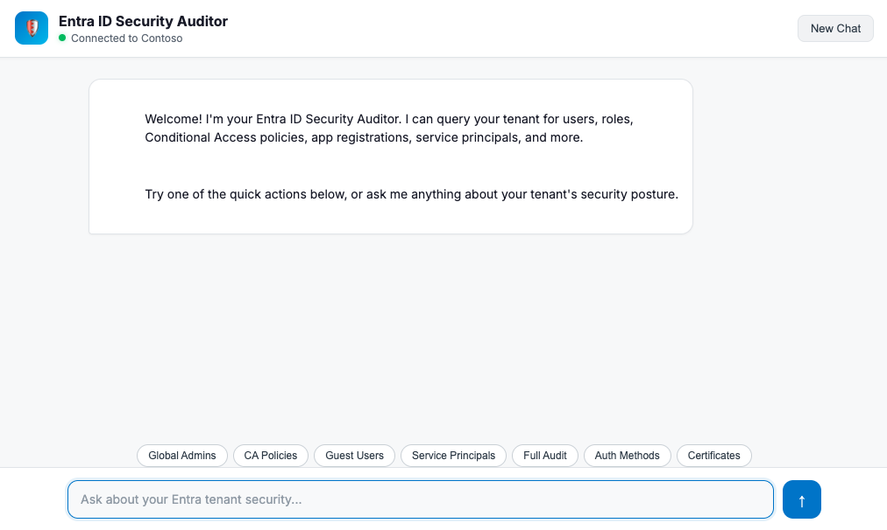
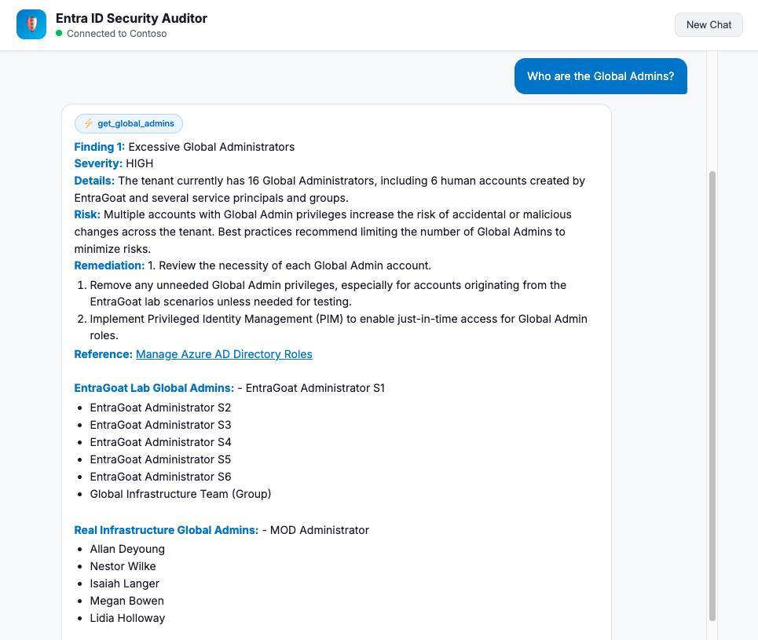

# Entra ID Security Auditor

An AI-powered security auditor for Microsoft Entra ID. It connects to a live tenant, retrieves real configuration data via Microsoft Graph API, and uses an Azure AI Foundry agent to analyze security misconfigurations, privilege escalation paths, and policy gaps.



---

## How It Works

```
┌───────────────────────────┐      ┌───────────────────────────┐
│     AI FOUNDRY TENANT     │      │     TARGET TENANT         │
│     (The "Brain")         │      │     (Being Audited)       │
│                           │      │                           │
│  ┌─────────────────────┐  │      │  ┌─────────────────────┐  │
│  │  AuditAssistant     │  │      │  │  App Registration   │  │
│  │  (GPT-4o agent)     │  │      │  │  + Graph API perms  │  │
│  └──────────▲──────────┘  │      │  └──────────▲──────────┘  │
└─────────────│─────────────┘      └─────────────│─────────────┘
              │                                  │
       Azure OpenAI API                Microsoft Graph API
              │                                  │
        ┌─────┴──────────────────────────────────┴──────┐
        │              Flask Web App                    │
        │     (bridges both APIs + serves chat UI)      │
        └───────────────────────────────────────────────┘
```

Your Python app acts as the bridge. It authenticates to the target Entra tenant using Client ID/Secret, fetches data via Graph API, then sends it to the AI agent for analysis. The AI and Entra never talk directly — the app talks to both separately.

### Data Injection Pattern

Azure AI Foundry agents using `agent_reference` don't support runtime `tools=` parameters. Instead, the Flask backend uses **keyword detection** to identify what data the user needs, fetches it from Graph API, and appends it to the user's message as `[LIVE TENANT DATA]` blocks. The AI agent then analyzes the real JSON data in its response.

---

## Features

- **Live tenant connection** — dynamic header shows connected tenant name with status indicator
- **16+ audit queries** — Global Admins, Conditional Access, service principals, app registrations, MFA, guest users, sign-in logs, risky users, named locations, and more
- **Full security audit** — single command fetches all data sources for comprehensive analysis
- **Severity-rated findings** — CRITICAL / HIGH / MEDIUM / LOW with remediation steps
- **Baseline tagging** (optional) — snapshot your clean tenant before deploying lab environments (like EntraGoat) to distinguish real infrastructure from lab objects
- **Quick action buttons** — one-click common security queries
- **Conversation memory** — multi-turn chat with context retention

---

## Prerequisites

- Python 3.10+
- An **Azure AI Foundry** project with a deployed agent (GPT-4o recommended)
- A **target Entra ID tenant** with an App Registration that has read-only Graph API permissions
- Azure CLI (`az login`) for authenticating to AI Foundry

### Required Graph API Permissions (Application type)

| Permission | Why |
|---|---|
| `User.Read.All` | Read all user profiles |
| `Directory.Read.All` | Read directory data (roles, groups) |
| `Policy.Read.All` | Read Conditional Access and auth methods policies |
| `RoleManagement.Read.Directory` | Read directory role assignments |
| `Application.Read.All` | Read app registrations and service principals |
| `AuditLog.Read.All` | Read sign-in logs |
| `IdentityRiskyUser.Read.All` | Read risky user information |
| `Policy.Read.ConditionalAccess` | Read Conditional Access policies |

---

## Quick Start

### 1. Clone and install

```bash
git clone https://github.com/stasdot/entra-audit-agent.git
cd entra-audit-agent
python -m venv .venv
source .venv/bin/activate  # On Windows: .venv\Scripts\activate
pip install -r requirements.txt
```

### 2. Configure

```bash
cp .env.example .env
```

Edit `.env` with your credentials:

```env
# Azure AI Foundry
AI_PROJECT_ENDPOINT=https://your-project.services.ai.azure.com/api/projects/your-project
AGENT_NAME=AuditAssistant

# Target Entra tenant
ENTRA_TENANT_ID=your-tenant-id
ENTRA_CLIENT_ID=your-client-id
ENTRA_CLIENT_SECRET=your-client-secret
```

### 3. Login to Azure CLI (for AI Foundry auth)

```bash
az login
```

### 4. Run

```bash
python app.py
```

Open http://localhost:5555 and start auditing.

---

## Example Queries

| Query | What it does |
|-------|-------------|
| "Who are the Global Admins?" | Fetches admin role members, analyzes for excessive privileges |
| "Show me all Conditional Access policies" | Retrieves CA policies, checks for gaps |
| "Are there guest users with elevated privileges?" | Lists guest users with any directory role |
| "Check for overprivileged service principals" | Finds SPs with dangerous Graph API permissions |
| "Run a full security audit" | Fetches all data, produces comprehensive report |
| "What authentication methods are enabled?" | Reviews MFA policy configuration |
| "Find stale or inactive accounts" | Checks for accounts with no recent sign-in |

---

## Optional: Baseline Tagging (for Lab Environments)

If you're testing against a vulnerable-by-design environment like [EntraGoat](https://github.com/Semperis/EntraGoat), you can snapshot your clean tenant first so the agent can distinguish real infrastructure from lab objects.

### 1. Export your clean tenant (PowerShell + Graph SDK)

```powershell
Connect-MgGraph -TenantId "<YOUR_TENANT_ID>" -Scopes "Directory.Read.All"

Get-MgUser -All | Select-Object Id, DisplayName, UserPrincipalName | ConvertTo-Json | Out-File baseline_users.json
Get-MgApplication -All | Select-Object Id, DisplayName, AppId | ConvertTo-Json | Out-File baseline_apps.json
Get-MgServicePrincipal -All | Select-Object Id, DisplayName, AppId | ConvertTo-Json | Out-File baseline_serviceprincipals.json
Get-MgGroup -All | Select-Object Id, DisplayName | ConvertTo-Json | Out-File baseline_groups.json
```

### 2. Place the JSON files in the project root

The app automatically detects `baseline.py` and the JSON files. If present, every object gets tagged with `_source: "BASELINE"` or `_source: "NEW (likely EntraGoat)"`.

### 3. Deploy your lab, then audit

```powershell
# Example with EntraGoat scenarios
./scenarios/EntraGoat-Scenario1-Setup.ps1
```

Now when you ask the agent to audit, it will clearly label which findings relate to lab objects vs real infrastructure.

---

## Tested Against: EntraGoat

This project was tested against all 6 [EntraGoat](https://github.com/Semperis/EntraGoat) scenarios — a "vulnerable by design" Entra ID environment by Semperis:

| Scenario | Focus | Agent Result |
|----------|-------|-------------|
| 1 | Service Principal Ownership Abuse | Identified new users and SPs, analyzed privilege escalation paths |
| 2 | Overprivileged App Registrations | Flagged apps with dangerous Graph API permissions |
| 3 | Group Ownership Exploitation | Detected role-assignable groups with exploitable ownership |
| 4 | Conditional Access Gaps | Found disabled CA policies, missing MFA enforcement |
| 5 | Dangerous API Permissions | Mapped service principal app role assignments, identified `Application.ReadWrite.All` grants |
| 6 | Certificate-Based Impersonation | Required targeted prompting but identified certificate credentials on suspicious SPs |

### Sample Audit Output

The agent produced findings like:

> **Finding 1: Excessive Global Administrators**
> **Severity:** CRITICAL  
> **Details:** 16 Global Administrator accounts exist. Only two are baseline user accounts; the rest are either service principals or lab-created user accounts/groups.  
> **Risk:** Increased attack surface for privilege escalation and potential internal/external abuse.  
> **Remediation:** Reduce the number of Global Administrators to two primary human accounts.

---

## Project Structure

```
entra-audit-agent/
├── app.py                  # Flask backend — keyword routing, data injection, AI bridge
├── graph_client.py         # Microsoft Graph API client — all Entra data fetching
├── baseline.py             # Optional: baseline tagging for lab vs real infrastructure
├── templates/
│   └── index.html          # Chat UI — white theme, dynamic tenant connection, markdown rendering
├── requirements.txt        # Python dependencies
├── .env.example            # Template for credentials
└── .gitignore              # Excludes secrets and baseline snapshots
```

---

## System Prompt

The AI agent uses a structured system prompt configured in Azure AI Foundry. Key sections include:

- **Audit methodology** — 16-point checklist covering Identity & Access, Conditional Access, Applications & Service Principals, and Authentication
- **Severity ratings** — CRITICAL through LOW with clear definitions
- **Output format** — structured findings with Details, Risk, Remediation, and References
- **Baseline awareness** — instructions for interpreting `_source` tags when baseline files are present

See [docs/system-prompt.md](docs/system-prompt.md) for the full prompt.

---

## Limitations

- **Keyword-based routing** — the backend relies on keyword detection rather than AI intent classification. If a query doesn't contain expected keywords, data won't be fetched. Quick-action buttons help mitigate this.
- **No write access** — the agent is read-only by design. It cannot remediate findings automatically.
- **Ownership data** — the current Graph API queries don't include service principal ownership chains. Adding `/servicePrincipals/{id}/owners` would improve privilege escalation detection.
- **Permission GUID resolution** — app role assignments return GUIDs, not human-readable permission names. A lookup table would improve analysis accuracy.

---

## License

MIT
